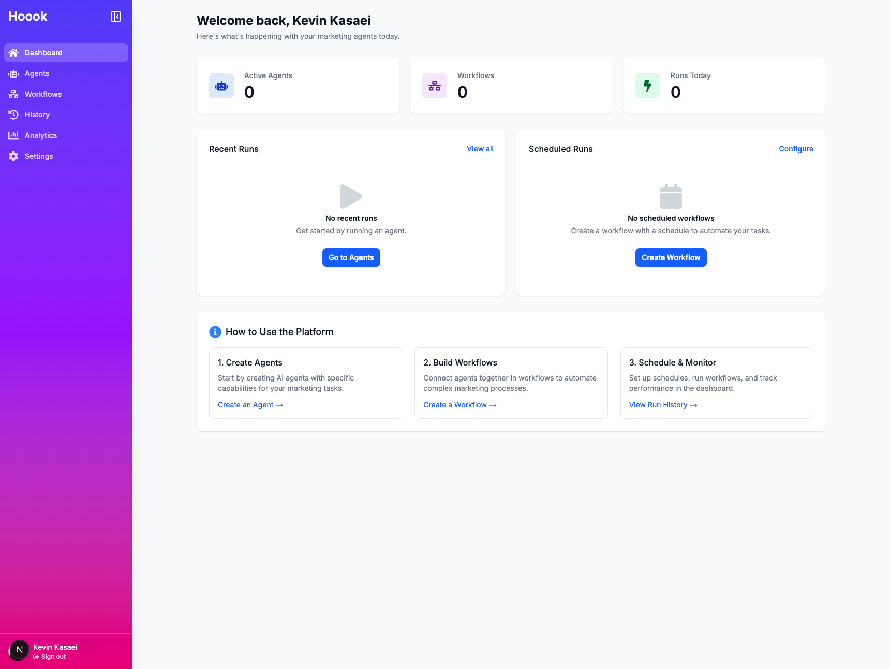
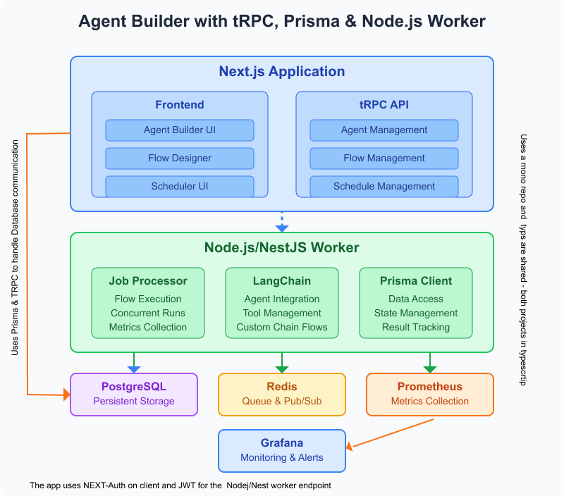

# Capitaly

An AI Agentic Platform for Investor Research, Outreach, Raising Capital & Engagement



## Architecuter



## What's inside?

This turborepo includes the following packages/apps:

### Apps and packages

- `web`: a [Next.js](https://nextjs.org/) app
- `@repo/eslint-config`: `eslint` configurations (includes `eslint-config-next` and `eslint-config-prettier`)
- `@repo/database`: [Prisma ORM](https://prisma.io/) to manage & access your database
- `@repo/typescript-config`: `tsconfig.json`s used throughout the monorepo

Each package/app is 100% [TypeScript](https://www.typescriptlang.org/).

### Utilities

This turborepo has some additional tools already setup for you:

- [TypeScript](https://www.typescriptlang.org/) for static type checking
- [ESLint](https://eslint.org/) for code linting
- [Prettier](https://prettier.io) for code formatting
- [Prisma ORM](https://prisma.io/) for accessing the database
- [Docker Compose](https://docs.docker.com/compose/) for a local MySQL database

## Getting started

Follow these steps to set up and run your Turborepo project with Prisma ORM:

### 1. Create a Turborepo project

Start by creating a new Turborepo project using the following command:

```sh
npx create-turbo@latest -e with-prisma
```

Choose your desired package manager when prompted and a name for the app (e.g., `my-turborepo`). This will scaffold a new Turborepo project with Prisma ORM included and dependencies installed.

Navigate to your project directory:

```bash
cd ./my-turborepo
```

### 2. Setup a local database with Docker Compose

We use [Prisma ORM](https://prisma.io/) to manage and access our database. As such you will need a database for this project, either locally or hosted in the cloud.

To make this process easier, a [`docker-compose.yml` file](./docker-compose.yml) is included to setup a MySQL server locally with a new database named `turborepo`:

Start the MySQL database using Docker Compose:

```sh
docker-compose up -d
```

To change the default database name, update the `MYSQL_DATABASE` environment variable in the [`docker-compose.yml` file](/docker-compose.yml).

### 3. Setup environment variables

Once the database is ready, copy the `.env.example` file to the [`/packages/database`](./packages/database/) and [`/apps/web`](./apps/web/) directories as `.env`:

```bash
cp .env.example ./packages/database/.env
cp .env.example ./apps/web/.env
```

This ensures Prisma has access to the `DATABASE_URL` environment variable, which is required to connect to your database.

If you added a custom database name, or use a cloud based database, you will need to update the `DATABASE_URL` in your `.env` accordingly.

### 4. Migrate your database

Once your database is running, you'll need to create and apply migrations to set up the necessary tables. Run the database migration command:

```bash
# Using npm
npm run db:migrate:dev
```

<details>

<summary>Expand for <code>yarn</code>, <code>pnpm</code> or <code>bun</code></summary>

```bash
# Using yarn
yarn run db:migrate:dev

# Using pnpm
pnpm run db:migrate:dev

# Using bun
bun run db:migrate:dev
```

</details>

You'll be prompted to name the migration. Once you provide a name, Prisma will create and apply the migration to your database.

> Note: The `db:migrate:dev` script (located in [packages/database/package.json](/packages/database/package.json)) uses [Prisma Migrate](https://www.prisma.io/migrate) under the hood.

For production environments, always push schema changes to your database using the [`prisma migrate deploy` command](https://www.prisma.io/docs/orm/prisma-client/deployment/deploy-database-changes-with-prisma-migrate). You can find an example `db:migrate:deploy` script in the [`package.json` file](/packages/database/package.json) of the `database` package.

### 5. Seed your database

To populate your database with initial or fake data, use [Prisma's seeding functionality](https://www.prisma.io/docs/guides/database/seed-database).

Update the seed script located at [`packages/database/src/seed.ts`](/packages/database/src/seed.ts) to include any additional data that you want to seed. Once edited, run the seed command:

```bash
# Using npm
npm run db:seed
```

<details>

<summary>Expand for <code>yarn</code>, <code>pnpm</code> or <code>bun</code></summary>

```bash
# Using yarn
yarn run db:seed

# Using pnpm
pnpm run db:seed

# Using bun
bun run db:seed
```

</details>

### 6. Build your application

To build all apps and packages in the monorepo, run:

```bash
# Using npm
npm run build
```

<details>

<summary>Expand for <code>yarn</code>, <code>pnpm</code> or <code>bun</code></summary>

```bash
# Using yarn
yarn run build

# Using pnpm
pnpm run build

# Using bun
bun run build
```

</details>

### 7. Start the application

Finally, start your application with:

```bash
yarn run dev
```

<details>

<summary>Expand for <code>yarn</code>, <code>pnpm</code> or <code>bun</code></summary>

```bash
# Using yarn
yarn run dev

# Using pnpm
pnpm run dev

# Using bun
bun run dev
```

</details>

Your app will be running at `http://localhost:3000`. Open it in your browser to see it in action!

You can also read the official [detailed step-by-step guide from Prisma ORM](https://pris.ly/guide/turborepo?utm_campaign=turborepo-example) to build a project from scratch using Turborepo and Prisma ORM.

## Useful Links

Learn more about the power of Turborepo:

- [Tasks](https://turborepo.com/docs/crafting-your-repository/running-tasks)
- [Caching](https://turborepo.com/docs/crafting-your-repository/caching)
- [Remote Caching](https://turborepo.com/docs/core-concepts/remote-caching)
- [Filtering](https://turborepo.com/docs/crafting-your-repository/running-tasks#using-filters)
- [Configuration Options](https://turborepo.com/docs/reference/configuration)
- [CLI Usage](https://turborepo.com/docs/reference/command-line-reference)
